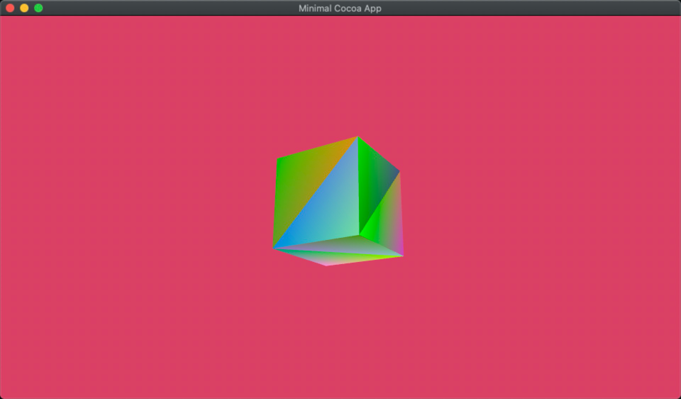

# Minimal CMake Cocoa App

Minimal cmake cocoa app with customized `NSView` drawing using OpenGL.

It demonstrates:

- how to manually build Mac OSX App by cmake.
- a minimal set of code we need to create.
- how to combine object-c with C/CXX.

All OpenGL API callings are organized into an extern CXX module call `GraphicsManager`(it's not a module now, but it can
be), in case we want to immigrate out drawing code to other platform. It is pure CXX, with only standard CXX lib.

## Build And Run

```shell
# build
mkdir -p build
cd build
rm -rf *
cmake -DCMAKE_OSX_ARCHITECTURES=x86_64 -DCMAKE_BUILD_TYPE=Debug -G "Xcode" ..
cmake --build . --config debug

# run
./Debug/CocoaApp.app/Contents/MacOS/CocoaApp 
```

Result:

Scroll to zoom, drag to rotate.



## Project Structure

```shell
.
├── AppDelegate.h # AppDelegate header
├── AppDelegate.m # AppDelegate
├── CMakeLists.txt # cmake entry
├── CocoaApplication.mm # Main application entry
├── CustomizedView.h # Our customized view header
├── CustomizedView.mm # Our customized view entry
├── External # Put external dependencies here
│   └── GL                      # glad generated
├── GraphicsManager.cpp # Main entry for OpenGL API lied
├── GraphicsManager.h # header
├── LICENSE
├── README.md
├── WindowDelegate.h # WindowDelegate header
└── WindowDelegate.m # WindowDelegate

```

## Notices

- OpenGL is marked deprecated Mac OSX after 10.14. Some API usage or official tutorials are out of date. Usage
  like `lockFocus` do not work as the document said.(Could be my fault)
- It's a project for learning purpose, not for production.
